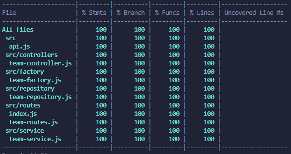

# Story: Seu primeiro time pokemon

A idéia é testar os fundamentos de `testing`, aplicando o que foi visto no 
`JS Expert - Módulo 02` num projeto simples e divertido.

Consumindo a [PokeAPI](https://pokeapi.co/), faça uma API que retorne 3 pokemóns aleatórios para formar seu time inicial numa jornada pokemon.

## Requisitos

### Funcionalidades
1. `GET /` 

Deve ser a rota padrão da aplicação ao tentar acessar qualquer rota inexistente. (ex.: `/hi`, `/hello`)

2. `GET /team`

Deve retornar um array com 3 pokemóns aleatórios, contendo seus respectivos `name` e `moves`, (mostrando apenas um array de strings com os 3 primeiros `moves` presentes na API. ex.: `["mega-punch","fire-punch","thunder-punch"]`).

### Testes

* [X] mocks
* [X] stubs
* [X] spies
* [X] testes end-2-end
* [X] testes unitários
* [X] 100% de code coverage

### Extras

* [X] TDD e BDD, será que rola? Acho que vale a tentativa!
* [X] Que tal consumir a API sem usar libs externas? o módulo `https` do node pode ser bem interessante!
### Checklist features

- Web API
  * [X] Deve ter uma rota raiz usada como _fallback_.
  * [X] Deve ter uma rota de `/team`, onde: 
    * [X] Deve consumir a PokeAPI e selecionar 3 pokemóns aleatórios
    * [X] Deve consumir a PokeAPI para obter mais informações sobre os pokemóns escolhidos
    * [X] Deve retornar um objeto JSON conetendo um array com 3 pokemóns, cada um com seus respectivos `name (String)` e `moves (String[])`

- Testes
  * [X] Deve ter cobertura de testes end-2-end e unitários
  * [X] 100% de code coverage

## O que adicionei a mais?
 - Apenas uma camada de "controller" com seus devidos testes unitários, realizei alguns mocks na request e response do http module.

## Print do code coverage


## Como rodar?
```bash
npm i # Para Instalar as dependências

#Rodando os testes
npm run test:unit #Para rodar apenas os testes unitários
npm run test:e2e #Para rodar os testes e2e
npm run test:cov #Roda os testes com o coverage

#Rodando a aplicação em modo dev
npm run dev

#Rodando em modo produção
npm start
```

## Submissão

1. Inicialize um repósitório git com um arquivo README.md contendo seu nome, quais tópicos do checklist foram implementados e, caso queira, um breve resumo de cada tópico.

2. Crie o projeto e os testes.

3. Coloque as instruções de como configurar e executar seu projeto e os testes no README.md (não se esqueça do coverage com o `nyc`).

4. Envie o link no canal `#desafios-jsexpert` da nossa comunidade no discord.
